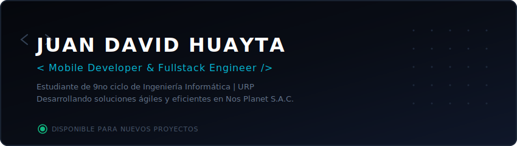

  

##  Sobre Mí

¡Hola! Soy **Juan David Huayta**, estudiante de 9no ciclo de **Ingeniería Informática** en la **Universidad Ricardo Palma** y Desarrollador Fullstack.

Actualmente me desempeño como **Desarrollador de Aplicativos Móviles** en **Nos Planet S.A.C.**, donde diseño e implemento soluciones móviles robustas y gestiono proyectos de manera autónoma y orientada a objetivos.

---

##  Proyectos Profesionales (Nos Planet S.A.C.)

Ecosistema y aplicaciones desarrollados profesionalmente para la logística y gestión ambiental:

<table>
  <tr>
    <td width="50%" valign="top">
      <h3> Ecosistema Recycle App</h3>
      
Plataforma integral para la gestión y concientización ambiental en el reciclaje de residuos sólidos.

      <ul>
        <li><b><a href="https://github.com/NOS-PLANET/Recycle-Front-App" target="_blank">Recycle-Front-App</a></b>: Aplicación móvil multiplataforma (React Native / Expo) para que usuarios registren entregas y acumulen puntos.</li>
        <li><b><a href="https://github.com/NOS-PLANET/Recycle-Web" target="_blank">Recycle-Web</a></b>: Panel web administrativo para supervisar rutas de recolección y estadísticas de impacto ecológico.</li>
        <li><b><a href="https://github.com/NOS-PLANET/Recycle-Backend" target="_blank">Recycle-Backend</a></b>: API Gateway y servicios que sustentan todo el ecosistema de reciclaje.</li>
      </ul>
      

        
        
        
      

    </td>
    <td width="50%" valign="top">
      <h3> booking-moto</h3>
      
Aplicación móvil y plataforma logística dedicada a la reserva, programación y gestión de asistencia técnica para motocicletas en tiempo real.

      <ul>
        <li>Optimización de flujos de reserva y geolocalización.</li>
        <li>Gestión del estado de servicios y notificaciones push.</li>
      </ul>
       
      

        
        
      

    </td>
  </tr>
</table>

---

##  Proyectos Personales

<table>
  <tr>
    <td width="50%" valign="top">
      <h3> <a href="https://github.com/ChethhSito/Automatizador_Archivos" target="_blank">Automatizador de Archivos</a></h3>
      
Aplicación de escritorio que corre en segundo plano y organiza automáticamente carpetas caóticas (ej. Descargas) mediante reglas personalizadas e Inteligencia Artificial.

      

        
        
      

    </td>
    <td width="50%" valign="top">
      <h3> <a href="https://github.com/ChethhSito/automatizador_plantillas_portfolio" target="_blank">Automatizador de Plantillas</a></h3>
      
Herramienta interactiva estilo "juego retro" diseñada para actualizar y personalizar plantillas de portafolios web de forma visual y lúdica.

      

        
        
      

    </td>
  </tr>
  <tr>
    <td width="50%" valign="top">
      <h3> <a href="https://github.com/ChethhSito/compras_futuro" target="_blank">Compras Futuro</a></h3>
      
Aplicación interactiva con una interfaz moderna y fluida para planificar, registrar y proyectar compras futuras de manera organizada.

      

        
        
      

    </td>
    <td width="50%" valign="top">
      <h3> <a href="https://github.com/ChethhSito/level-music-movil" target="_blank">Level Music Móvil</a></h3>
      
Aplicación móvil dedicada a la reproducción y gestión de música en streaming, con foco en interfaces de usuario interactivas.

      

        
        
      

    </td>
  </tr>
</table>

---

##  Tecnologías y Herramientas

###  Móvil y Frontend

  
  
  
  
  
  
  

###  Backend y Base de Datos

  
  
  
  
  

###  Herramientas y DevOps

  
  
  
  
  

---

##  Estadísticas de GitHub

  

 

  
  

---

##  Conectemos

  
  
  
  
  
  

---

  <i> San Juan de Miraflores, Lima, Perú 🇵🇪</i>

